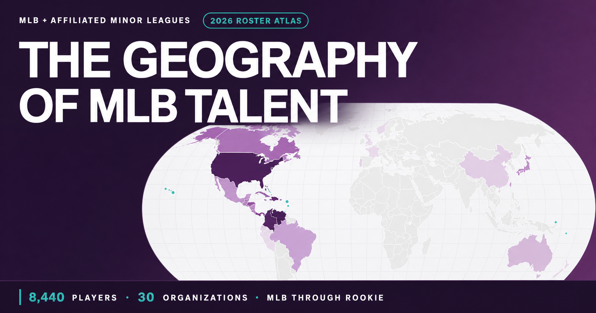

# The Geography of MLB Talent

An audited roster-and-birthplace geography project covering every unique player on an MLB organization full roster as of **August 24, 2026**. The snapshot includes MLB, Triple-A, Double-A, High-A, Single-A, and Rookie levels.

> [!IMPORTANT]
> **Corrected historical scope (August 24, 2026).** The school research uses 49,771 players whose first official MLB or affiliated MiLB season is 2000 or later. It excludes 5,209 pre-2000 career carryovers, including Barry Bonds. The complete participant universe and linked checksum are public. See [CORRECTION.md](CORRECTION.md).



**Interactive map:** [mlb-talent-map-2026.pages.dev](https://mlb-talent-map-2026.pages.dev)

**High-school pipeline:** [mlb-talent-map-2026.pages.dev/mlb-high-school-map](https://mlb-talent-map-2026.pages.dev/mlb-high-school-map)

**College pipeline:** [mlb-talent-map-2026.pages.dev/mlb-college-map](https://mlb-talent-map-2026.pages.dev/mlb-college-map)

## What the product does

- Includes 8,440 unique rostered players across all 30 MLB organizations and 201 affiliated teams.
- Maps U.S. birthplaces only when MLB birth city/state resolves uniquely through a federal GNIS populated place to a 2020 county-equivalent.
- Maps all 4,159 international or territory records to MLB's reported birth country using ISO-linked Natural Earth 5.1.1 country boundaries.
- Provides shareable U.S. county and worldwide birth-country views; all 43 known roster countries/territories have geometry, while one unknown-country record remains unmapped.
- Shows U.S. mapping coverage after every filter; ambiguous and unresolved places are never treated as zero.
- Supports filters for roster level, MLB organization, position group, roster status, birth country, and active-only status.
- Supports total players, players per 100,000 residents, MLB-level players, and pitchers.
- Withholds per-capita rankings until a county has at least 10 mapped players in the selected view.
- Reconciles 49,771 MLB/affiliated-MiLB career starters from 2000 onward and maps every U.S. high school credited with at least 20 of them.
- Audits the final school before each professional signing. College rankings remain withheld because documented college/non-college status covers 41.9% of the cohort, below the required 90% publication threshold.

## Route

- `/mlb-talent-map` — current MLB/MiLB roster birthplace map.
- `/mlb-high-school-map` — historical MLB/affiliated-MiLB pipeline by U.S. high school.
- `/mlb-college-map` — college evidence audit and publication status.

## High-school pipeline scope

- Reviews every player returned by official MLB season-player endpoints for MLB, Triple-A, Double-A, High-A, Single-A, Short-Season A, and Rookie levels from 1876 through 2026, then excludes anyone returned before 2000.
- Retains 49,771 eligible career starters: 5,372 who reached MLB and 44,399 who appeared only at an included affiliated minor-league level.
- Preserves exact participation seasons for every player and 6,441 U.S. high-school identities from MLB education records.
- Maps all 15 schools with at least 20 qualifying career starters and exposes the names, seasons, positions, and highest included level underlying every count.
- Audits every displayed campus coordinate against a source and its reported state boundary.

## College pipeline scope

- Uses the same 49,771-player career-start universe as the high-school map.
- Credits no more than one college per player: the last school supported immediately before the professional signing. Earlier transfer schools and unsigned draft selections receive no credit.
- Resolves 17,210 final-college records and 3,640 explicit non-college signing records; 28,921 players remain unresolved.
- Requires at least 44,794 resolved players (90%) before publishing rankings. Current documented coverage is 20,850 players (41.9%), so the interactive rankings and player lists are withheld.
- Never interprets a blank education field, international origin, foreign birth, or young signing age as proof that a player did not attend college.

## Reproduce and verify

The published data products are committed, so a clean clone validates, builds and
tests without any downloads:

```bash
npm ci
npm run check
```

`check` validates all three data products, builds both deployment targets, runs
unit tests, and exercises every rendered route in desktop and mobile Chromium.

### Rebuilding the data products

`npm run data:build` regenerates the data from source. It refreshes the official
MLB roster snapshot, the 1876–2026 career-start audit, and the college
signing-school reconciliation for the fixed publication date; it also reruns the
federal-place match and validates the Natural Earth country join.

It needs source files that are **not** redistributed in this repository — they are
public-domain or third-party downloads, cited in [ATTRIBUTION.md](ATTRIBUTION.md).
Place them in `data/raw/` before running:

| File | Source |
|---|---|
| `PopulatedPlaces_National_Text.zip`, `AllNames_National_Text.zip` | [USGS GNIS](https://www.usgs.gov/us-board-on-geographic-names/download-gnis-data) |
| `2025_Gaz_place_national.zip` | [Census Gazetteer](https://www.census.gov/geographies/reference-files/time-series/geo/gazetteer-files.html) |
| `natural-earth-50m/ne_50m_admin_0_countries.*` | [Natural Earth 1:50m](https://www.naturalearthdata.com/downloads/50m-cultural-vectors/) |
| `mlb-rosters-<date>.json` and other player-level snapshots | Fetched from the MLB Stats API; withheld because they carry player-level source fields |

## Evidence boundary

Roster membership and birth-country aggregation use MLB's person-ID snapshot directly. County geography is a conservative representative assignment because MLB exposes birth city/state/country, not exact birth county. A mapped country means the player is counted somewhere within MLB's reported birth country; a mapped county means the federal place reference resolves uniquely to that county and does not prove exact birth coordinates.

The current-roster browser payload omits player names and raw birth-city text. The historical high-school and college research publishes participant names and official person IDs because they are the auditable evidence behind each program count; no private personal data is included.

See [METHODOLOGY.md](METHODOLOGY.md), [DATA_QUALITY.md](DATA_QUALITY.md), [COLLEGE_SOURCE_AUDIT.md](COLLEGE_SOURCE_AUDIT.md), and [ATTRIBUTION.md](ATTRIBUTION.md).

## License

Original project code and documentation are MIT-licensed. Third-party data and source material retain their own terms; see [ATTRIBUTION.md](ATTRIBUTION.md).

This is an independent research project and is not affiliated with, sponsored by, or endorsed by Major League Baseball or any MLB club.
